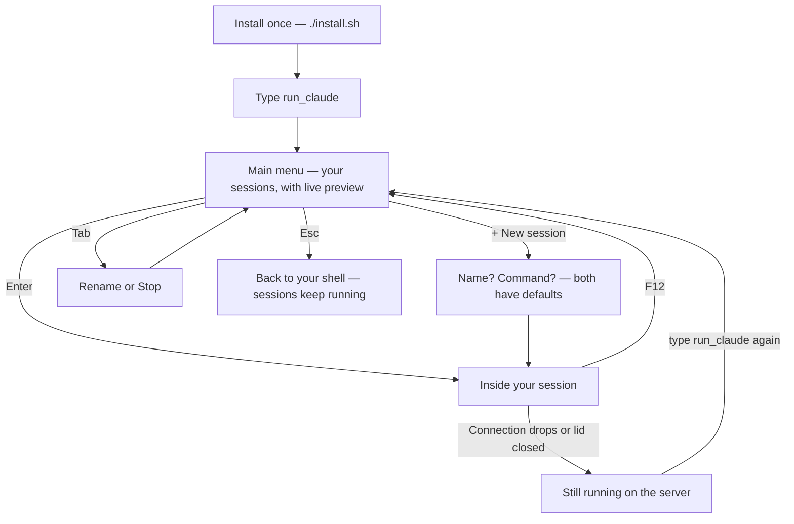

<div align="center">

# keep-ssh-agent-alive

### Close your laptop. Your AI agent keeps working.

[](https://github.com/tranvuongquocdat/keep-ssh-agent-alive/actions/workflows/ci.yml)
[](LICENSE)

**English** · [Tiếng Việt](README.vi.md)

</div>

You start Claude Code — or any long-running task — on a remote machine over
SSH. Then the connection drops, or you close the lid, and everything dies
with it.

This tool fixes that. Your sessions live on the server and survive any
disconnect, and everything is driven from a menu — arrow keys and Enter.
**There is nothing to memorize.**

## What you see

Type your command (you pick its name during install — default `run_claude`):

```text
╭─ ✳ run_claude ────────────────────╮╭─ preview ──────────────────╮
│                                   ││ ✳ Working on the parser…   │
│ ❯ agent-1    ● claude · attached  ││                            │
│   agent-2    ● claude             ││ > run the test suite       │
│   build      ○ idle               ││ ⎿  42 passed, 0 failed     │
│                                   ││                            │
│   + New session                   ││                            │
│                                   ││                            │
│ ❯ type to filter                  ││                            │
╰───────────────────────────────────╯╰────────────────────────────╯
  enter open · tab actions · ctrl-n new · ctrl-x stop · esc quit
```

- A green dot means something is running in that session.
- The right pane is a **live snapshot** of whatever is highlighted, so you
  can tell your agents apart before jumping in.
- Every key you can press is written at the bottom of the screen.

## How it flows



## Set up once

```sh
git clone https://github.com/tranvuongquocdat/keep-ssh-agent-alive.git
cd keep-ssh-agent-alive
./install.sh
```

The installer asks three questions, each with a sensible default:

1. **Language** — English or Tiếng Việt (for every menu and message)
2. **Command name** — what you will type to open the menu. Default is
   `run_claude`; if the name you pick already exists on your system, the
   installer warns you so the two do not collide.
3. **Default command** — what new sessions run. Default is `claude`.

It also offers to install the two things it needs (`tmux` and `fzf`) if they
are missing. Re-run `./install.sh` any time to change any answer.

**Windows:** there is no native tmux, so install
[MSYS2](https://www.msys2.org/) first (much lighter than WSL — no virtual
machine, ~300 MB), open its shell, and run the same three lines above.

## While you are inside a session

Your program gets the whole screen, except one calm bar at the bottom that
always shows the way out:

```text
 ✳ agent-1 · claude                     F12 back to menu · keeps running
```

Press **F12** — one key, no combinations — and you are back at the menu while
your program keeps running. (If you already know tmux, `Ctrl-b d` still works
too.)

## Everyday things

| You want to…                      | Do this                                        |
| --------------------------------- | ---------------------------------------------- |
| Start a new agent                 | Choose **+ New session**, press Enter twice    |
| Jump into a session               | Highlight it, press **Enter**                  |
| See what an agent is doing        | Just highlight it — the preview is live        |
| Leave without stopping anything   | **F12** inside a session, **Esc** in the menu  |
| Rename or stop a session          | Highlight it, press **Tab**, pick the action   |
| Find a session by name            | Just start typing                              |

**Closed your laptop? Lost Wi-Fi?** Nothing happened to your work. Reconnect,
type `run_claude`, and everything is exactly where you left it.

## Settings

Chosen during install, stored in `~/.config/keep-ssh-agent-alive/config`:

| Setting           | Default  | Meaning                                          |
| ----------------- | -------- | ------------------------------------------------ |
| `language`        | `en`     | Menu language: `en` or `vi`                      |
| `default_command` | `claude` | What new sessions run; empty means a plain shell |
| `session_prefix`  | `agent`  | Auto-generated names: `agent-1`, `agent-2`, …    |
| `mouse`           | `off`    | `on` lets you click the bottom bar to leave a session (text selection then needs Shift) |

## Questions, ideas, bugs

[Open an issue](../../issues/new/choose) — a short form guides you through
it, no knowledge of the code needed. Code contributions are welcome too: see
[CONTRIBUTING.md](CONTRIBUTING.md).

## License

Released under the [MIT License](LICENSE).
