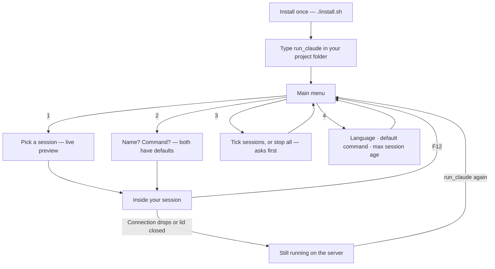

<div align="center">

# keep-ssh-agent-alive

### Close your laptop. Your AI agent keeps working.

[](https://github.com/tranvuongquocdat/keep-ssh-agent-alive/actions/workflows/ci.yml)
[](LICENSE)

**English** · [Tiếng Việt](README.vi.md)

</div>

You start Claude Code — or any long-running task — on a remote machine over
SSH. Then the connection drops, or you close the lid, and everything dies
with it.

This tool fixes that. Your sessions live on the server and survive any
disconnect. Everything is a menu: arrow keys, Enter to choose, Esc to go
back. **Nothing to memorize.**

## What you see

Type your command (you pick its name during install — default `run_claude`):

```text
╭─ ✳ run_claude ──────────────────────╮
│  enter: choose · esc: quit          │
│                                     │
│ ❯ 1 · Open a running session        │
│   2 · Create a new session          │
│   3 · Stop sessions                 │
│   4 · Settings                      │
│   5 · Quit                          │
╰─────────────────────────────────────╯
```

**1 · Open a running session** — your sessions, with a live view of what
each one is doing right now. Pick one and you are back inside. If nothing is
running, it simply tells you so.

```text
╭─ Open a running session ────────────╮╭─ preview ──────────────────╮
│  enter: choose · esc: back          ││ ✳ Working on the parser…   │
│                                     ││                            │
│ ❯ agent-1     ● claude · attached   ││ > run the test suite       │
│   agent-2     ● claude              ││ ⎿  42 passed, 0 failed     │
│   build       ○ idle                ││                            │
╰─────────────────────────────────────╯╰────────────────────────────╯
```

**2 · Create a new session** — two questions, both already answered for you.
Press Enter twice and you are in:

```text
Session name [agent-2]:
Command to run [claude]:
```

The new session starts **in the folder you opened the menu from**, so your
agent works on the right project.

**3 · Stop sessions** — tick one or more with Space, or choose "Stop all".
It always asks before stopping anything:

```text
╭─ Stop sessions ─────────────────────╮
│  space: select · enter: confirm     │
│                                     │
│   Stop all sessions                 │
│ ✓ agent-1     ● claude              │
│ ❯ build       ○ idle                │
╰─────────────────────────────────────╯
```

**4 · Settings** — change anything you chose at install time, no reinstall
needed:

```text
╭─ Settings ──────────────────────────╮
│ ❯ Language — English                │
│   Default command — claude          │
│   Maximum session age — unlimited   │
│   Back                              │
╰─────────────────────────────────────╯
```

## How it flows



## While you are inside a session

Your program gets the whole screen, except one calm bar at the bottom that
always shows the way out:

```text
 ✳ agent-1 · claude                     F12 back to menu · keeps running
```

Press **F12** — one key, no combinations — and you are back at the menu while
your program keeps running. Close the laptop, lose Wi-Fi, quit the SSH tab:
nothing happens to your work. Reconnect, type `run_claude`, and everything is
exactly where you left it.

## Set up once

Install it **on the machine that stays on** — your server. The laptop you
carry around needs nothing but a normal SSH connection to it.

The same three lines work everywhere:

```sh
git clone https://github.com/tranvuongquocdat/keep-ssh-agent-alive.git
cd keep-ssh-agent-alive
./install.sh
```

The installer asks three questions, each with a sensible default:

1. **Language** — English or Tiếng Việt, for every menu and message
2. **Command name** — what you will type to open the menu (default
   `run_claude`). If the name already exists on your system, it warns you.
3. **Default command** — what new sessions run (default `claude`; some
   people prefer e.g. `claude --dangerously-skip-permissions`)

It also offers to install the two small tools it needs (`tmux` and `fzf`) if
they are missing. Everything can be changed later in **Settings**.

### Notes per operating system

| Your server runs…                            | What to know                                                                                                                                                         |
| -------------------------------------------- | -------------------------------------------------------------------------------------------------------------------------------------------------------------------- |
| **Linux** (Ubuntu, Debian, Fedora, Arch, …)  | Works as is — the installer fetches `tmux` and `fzf` with your system's package manager (apt, dnf, pacman).                                                          |
| **Raspberry Pi**                             | Same as Linux: Raspberry Pi OS is Debian, so the installer uses apt. A Pi is a great cheap always-on home server for exactly this.                                   |
| **macOS**                                    | Works as is. If `tmux`/`fzf` are missing, the installer fetches them with [Homebrew](https://brew.sh) — install that first if you don't have it.                     |
| **Windows**                                  | No native tmux. Install [MSYS2](https://www.msys2.org/) first (much lighter than WSL — no virtual machine, ~300 MB), open its shell, then run the three lines above. |

## Adding a language

Every text in the interface lives in one small file per language
([`lang/en.sh`](lang/en.sh), [`lang/vi.sh`](lang/vi.sh)). To add French:
copy `en.sh` to `fr.sh`, translate the values, done — it appears in
Settings automatically. Pull requests for new languages are very welcome.

## Questions, ideas, bugs

[Open an issue](../../issues/new/choose) — a short form guides you through
it, no knowledge of the code needed. Code contributions: see
[CONTRIBUTING.md](CONTRIBUTING.md).

## License

Released under the [MIT License](LICENSE).
