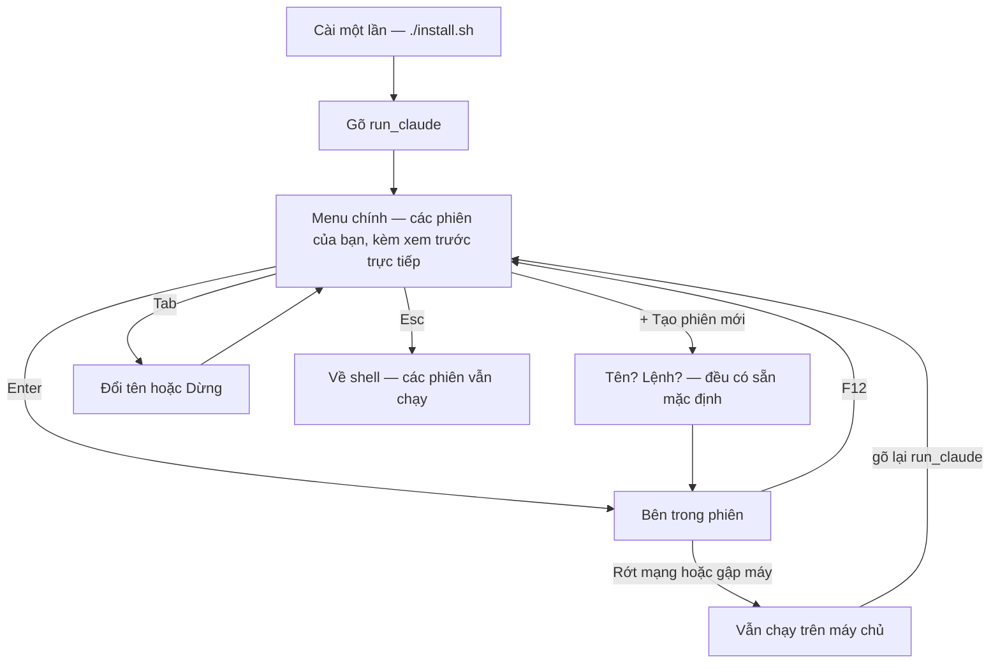

<div align="center">

# keep-ssh-agent-alive

### Gập máy thoải mái. AI agent của bạn vẫn tiếp tục làm việc.

[](https://github.com/tranvuongquocdat/keep-ssh-agent-alive/actions/workflows/ci.yml)
[](LICENSE)

[English](README.md) · **Tiếng Việt**

</div>

Bạn khởi động Claude Code — hoặc bất kỳ tác vụ chạy lâu nào — trên một máy
chủ qua SSH. Rồi mạng rớt, hoặc bạn gập máy, và mọi thứ chết theo kết nối.

Công cụ này giải quyết đúng chuyện đó. Các phiên làm việc nằm trên máy chủ
và sống sót qua mọi lần mất kết nối, còn mọi thao tác đều qua menu — phím
mũi tên và Enter. **Không phải ghi nhớ bất cứ điều gì.**

## Những gì bạn thấy

Gõ lệnh của bạn (tên lệnh do bạn chọn lúc cài — mặc định là `run_claude`):

```text
╭─ ✳ run_claude ────────────────────╮╭─ xem trước ────────────────╮
│                                   ││ ✳ Đang sửa parser…         │
│ ❯ agent-1    ● claude · đang mở   ││                            │
│   agent-2    ● claude             ││ > chạy bộ test             │
│   build      ○ chờ                ││ ⎿  42 passed, 0 failed     │
│                                   ││                            │
│   + Tạo phiên mới                 ││                            │
│                                   ││                            │
│ ❯ gõ để lọc                       ││                            │
╰───────────────────────────────────╯╰────────────────────────────╯
  enter mở · tab hành động · ctrl-n tạo mới · ctrl-x dừng · esc thoát
```

- Chấm xanh nghĩa là phiên đó đang có chương trình chạy.
- Khung bên phải là **ảnh chụp trực tiếp** của phiên đang được chọn, nên bạn
  phân biệt được các agent trước khi vào.
- Mọi phím bấm được đều ghi sẵn ở đáy màn hình.

## Luồng hoạt động



## Cài đặt một lần

```sh
git clone https://github.com/tranvuongquocdat/keep-ssh-agent-alive.git
cd keep-ssh-agent-alive
./install.sh
```

Trình cài đặt hỏi ba câu, câu nào cũng có sẵn đáp án mặc định:

1. **Ngôn ngữ** — English hoặc Tiếng Việt (áp dụng cho toàn bộ menu và thông báo)
2. **Tên lệnh** — thứ bạn sẽ gõ để mở menu. Mặc định là `run_claude`; nếu tên
   bạn chọn đã tồn tại trên hệ thống, trình cài đặt sẽ cảnh báo để tránh
   xung đột.
3. **Lệnh mặc định** — chương trình mà phiên mới sẽ chạy. Mặc định là `claude`.

Nếu máy còn thiếu hai thứ công cụ cần (`tmux` và `fzf`), trình cài đặt sẽ đề
nghị cài giúp. Chạy lại `./install.sh` bất cứ lúc nào để đổi các lựa chọn.

**Windows:** không có tmux bản gốc, nên hãy cài
[MSYS2](https://www.msys2.org/) trước (nhẹ hơn WSL nhiều — không máy ảo,
khoảng 300 MB), mở shell của nó và chạy đúng ba dòng lệnh ở trên.

## Khi đang ở trong một phiên

Chương trình của bạn chiếm toàn màn hình, chỉ trừ một thanh nhỏ dưới đáy luôn
ghi sẵn lối ra:

```text
 ✳ agent-1 · claude                  F12 quay về menu · tiến trình vẫn chạy
```

Bấm **F12** — một phím duy nhất, không tổ hợp — là bạn quay về menu, chương
trình bên trong vẫn tiếp tục chạy. (Ai đã quen tmux thì `Ctrl-b d` vẫn dùng
được như thường.)

## Các việc thường ngày

| Bạn muốn…                          | Làm thế này                                     |
| ---------------------------------- | ----------------------------------------------- |
| Khởi động một agent mới            | Chọn **+ Tạo phiên mới**, bấm Enter hai lần     |
| Vào một phiên                      | Di chuyển đến nó, bấm **Enter**                 |
| Xem một agent đang làm gì          | Chỉ cần di chuyển đến nó — khung xem trước là trực tiếp |
| Rời đi mà không dừng gì cả         | **F12** khi trong phiên, **Esc** khi ở menu     |
| Đổi tên hoặc dừng một phiên        | Di chuyển đến nó, bấm **Tab**, chọn hành động   |
| Tìm phiên theo tên                 | Cứ gõ tên là danh sách tự lọc                   |

**Gập máy? Mất Wi-Fi?** Công việc của bạn không hề hấn gì. Kết nối lại, gõ
`run_claude`, mọi thứ vẫn nguyên chỗ cũ.

## Thiết lập

Được chọn lúc cài, lưu tại `~/.config/keep-ssh-agent-alive/config`:

| Thiết lập         | Mặc định | Ý nghĩa                                          |
| ----------------- | -------- | ------------------------------------------------ |
| `language`        | `en`     | Ngôn ngữ menu: `en` hoặc `vi`                    |
| `default_command` | `claude` | Lệnh phiên mới sẽ chạy; để trống là shell thường |
| `session_prefix`  | `agent`  | Tên tự sinh: `agent-1`, `agent-2`, …             |
| `mouse`           | `off`    | `on` cho phép click thanh đáy để rời phiên (khi đó bôi đen chọn chữ cần giữ Shift) |

## Câu hỏi, ý tưởng, lỗi

[Mở một issue](../../issues/new/choose) — biểu mẫu ngắn sẽ dẫn bạn từng bước,
không cần hiểu mã nguồn. Đóng góp mã cũng rất hoan nghênh: xem
[CONTRIBUTING.md](CONTRIBUTING.md).

## Giấy phép

Phát hành theo [Giấy phép MIT](LICENSE).
