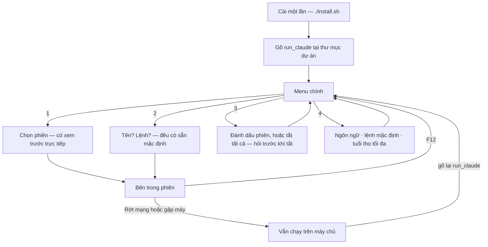

<div align="center">

# keep-ssh-agent-alive

### Gập máy thoải mái. AI agent của bạn vẫn tiếp tục làm việc.

[](https://github.com/tranvuongquocdat/keep-ssh-agent-alive/actions/workflows/ci.yml)
[](LICENSE)

[English](README.md) · **Tiếng Việt**

</div>

Bạn khởi động Claude Code — hoặc bất kỳ tác vụ chạy lâu nào — trên một máy
chủ qua SSH. Rồi mạng rớt, hoặc bạn gập máy, và mọi thứ chết theo kết nối.

Công cụ này giải quyết đúng chuyện đó. Các phiên làm việc nằm trên máy chủ
và sống sót qua mọi lần mất kết nối. Tất cả đều là menu: phím mũi tên,
Enter để chọn, Esc để quay lại. **Không phải ghi nhớ gì cả.**

## Những gì bạn thấy

Gõ lệnh của bạn (tên lệnh do bạn chọn lúc cài — mặc định là `run_claude`):

```text
╭─ ✳ run_claude ──────────────────────╮
│  enter: chọn · esc: thoát           │
│                                     │
│ ❯ 1 · Mở phiên đang chạy            │
│   2 · Tạo phiên mới                 │
│   3 · Tắt phiên                     │
│   4 · Cài đặt                       │
│   5 · Thoát                         │
╰─────────────────────────────────────╯
```

**1 · Mở phiên đang chạy** — danh sách phiên của bạn, kèm hình ảnh trực tiếp
mỗi phiên đang làm gì. Chọn một cái là vào lại ngay. Nếu chưa có gì chạy,
menu sẽ báo rõ.

```text
╭─ Mở phiên đang chạy ────────────────╮╭─ xem trước ────────────────╮
│  enter: chọn · esc: quay lại        ││ ✳ Đang sửa parser…         │
│                                     ││                            │
│ ❯ agent-1     ● claude · đang mở    ││ > chạy bộ test             │
│   agent-2     ● claude              ││ ⎿  42 passed, 0 failed     │
│   build       ○ chờ                 ││                            │
╰─────────────────────────────────────╯╰────────────────────────────╯
```

**2 · Tạo phiên mới** — hai câu hỏi, đều có sẵn đáp án. Bấm Enter hai lần
là vào:

```text
Tên phiên [agent-2]:
Lệnh chạy [claude]:
```

Phiên mới khởi động **tại đúng thư mục bạn mở menu**, nên agent làm việc
đúng dự án của bạn.

**3 · Tắt phiên** — đánh dấu một hoặc nhiều phiên bằng phím Space, hoặc chọn
"Tắt tất cả". Luôn hỏi xác nhận trước khi tắt:

```text
╭─ Tắt phiên ─────────────────────────╮
│  space: chọn · enter: xác nhận      │
│                                     │
│   Tắt tất cả các phiên              │
│ ✓ agent-1     ● claude              │
│ ❯ build       ○ chờ                 │
╰─────────────────────────────────────╯
```

**4 · Cài đặt** — đổi mọi lựa chọn lúc cài, không cần cài lại:

```text
╭─ Cài đặt ────────────────────────────────╮
│ ❯ Ngôn ngữ — Tiếng Việt                  │
│   Lệnh mặc định — claude                 │
│   Tuổi thọ tối đa — không giới hạn       │
│   Quay lại                               │
╰──────────────────────────────────────────╯
```

## Luồng hoạt động



## Khi đang ở trong một phiên

Chương trình của bạn chiếm toàn màn hình, chỉ trừ một thanh nhỏ dưới đáy
luôn ghi sẵn lối ra:

```text
 ✳ agent-1 · claude                  F12 quay về menu · tiến trình vẫn chạy
```

Bấm **F12** — một phím duy nhất, không tổ hợp — là quay về menu, chương
trình bên trong vẫn chạy tiếp. Gập máy, mất Wi-Fi, tắt tab SSH: công việc
của bạn không hề hấn gì. Kết nối lại, gõ `run_claude`, mọi thứ vẫn nguyên
chỗ cũ.

## Cài đặt một lần

Cài **trên máy luôn bật** — tức là máy chủ của bạn. Chiếc laptop mang đi
khắp nơi không cần cài gì, chỉ cần kết nối SSH bình thường tới máy đó.

Ba dòng lệnh này dùng chung cho mọi hệ điều hành:

```sh
git clone https://github.com/tranvuongquocdat/keep-ssh-agent-alive.git
cd keep-ssh-agent-alive
./install.sh
```

Trình cài đặt hỏi ba câu, câu nào cũng có sẵn đáp án mặc định:

1. **Ngôn ngữ** — English hoặc Tiếng Việt, cho toàn bộ menu và thông báo
2. **Tên lệnh** — thứ bạn sẽ gõ để mở menu (mặc định `run_claude`). Nếu tên
   đã tồn tại trên hệ thống, sẽ có cảnh báo.
3. **Lệnh mặc định** — chương trình phiên mới sẽ chạy (mặc định `claude`;
   có người thích đặt là `claude --dangerously-skip-permissions` chẳng hạn)

Nếu máy còn thiếu hai công cụ nhỏ cần thiết (`tmux` và `fzf`), trình cài đặt
sẽ đề nghị cài giúp. Về sau mọi thứ đổi được trong mục **Cài đặt**.

### Lưu ý theo hệ điều hành

| Máy chủ của bạn chạy…                        | Cần biết gì                                                                                                                                                  |
| -------------------------------------------- | ------------------------------------------------------------------------------------------------------------------------------------------------------------ |
| **Linux** (Ubuntu, Debian, Fedora, Arch, …)  | Chạy được ngay — trình cài đặt tự lấy `tmux` và `fzf` bằng trình quản lý gói của hệ thống (apt, dnf, pacman).                                                |
| **Raspberry Pi**                             | Giống hệt Linux: Raspberry Pi OS chính là Debian, nên trình cài đặt dùng apt. Một chiếc Pi là máy chủ mini luôn bật, rẻ và lý tưởng cho đúng việc này.       |
| **macOS**                                    | Chạy được ngay. Nếu thiếu `tmux`/`fzf`, trình cài đặt lấy qua [Homebrew](https://brew.sh) — chưa có Homebrew thì cài trước.                                  |
| **Windows**                                  | Không có tmux bản gốc. Cài [MSYS2](https://www.msys2.org/) trước (nhẹ hơn WSL nhiều — không máy ảo, khoảng 300 MB), mở shell của nó rồi chạy ba dòng ở trên. |

## Thêm một ngôn ngữ

Toàn bộ chữ trong giao diện nằm trong một tập tin nhỏ cho mỗi ngôn ngữ
([`lang/en.sh`](lang/en.sh), [`lang/vi.sh`](lang/vi.sh)). Muốn thêm tiếng
Pháp: sao chép `en.sh` thành `fr.sh`, dịch các giá trị, xong — nó tự xuất
hiện trong Cài đặt. Rất hoan nghênh pull request cho ngôn ngữ mới.

## Câu hỏi, ý tưởng, lỗi

[Mở một issue](../../issues/new/choose) — biểu mẫu ngắn sẽ dẫn bạn từng
bước, không cần hiểu mã nguồn. Đóng góp mã: xem
[CONTRIBUTING.md](CONTRIBUTING.md).

## Giấy phép

Phát hành theo [Giấy phép MIT](LICENSE).
